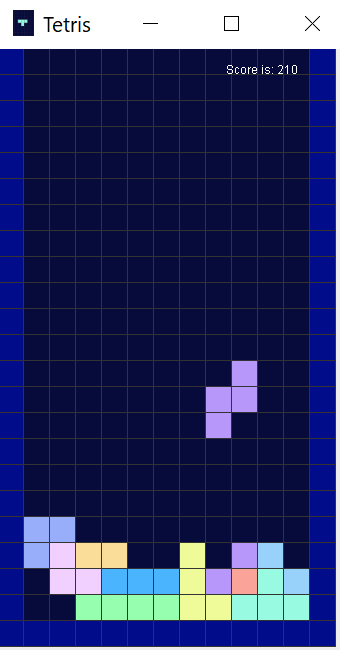

# Tetris

A basic tetris game completed for Data Structures II final project

##### Contributors
* [Jennifer Komendant](https://github.com/jkomendant)
* [Rachel Gutmann](https://github.com/rachel613g)
* [Shira Alter](https://github.com/shiraalter)

Download executable [jar file](https://github.com/shiraalter/Tetris/raw/main/build/libs/Tetris_Game-1.0-SNAPSHOT.jar)

##### Resources:
[Learn to create a Tetris game in Java with Swing](https://www.ssaurel.com/blog/learn-to-create-a-tetris-game-in-java-with-swing/)  
[Create Tetris Game Using Java](https://www.youtube.com/watch?v=KjEaD0KyL0w)  
